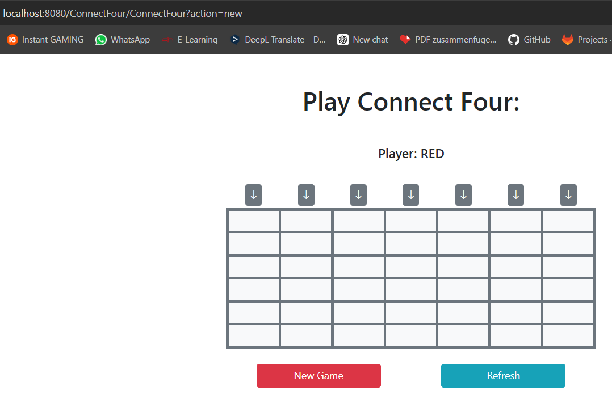
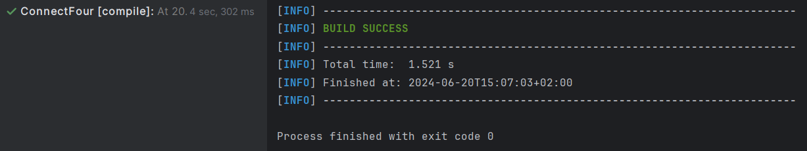
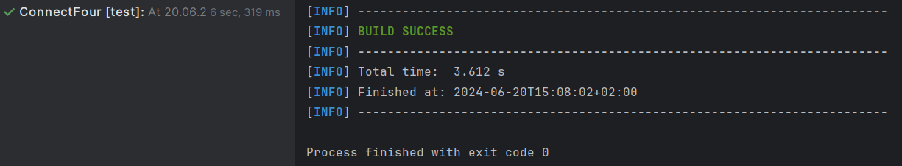
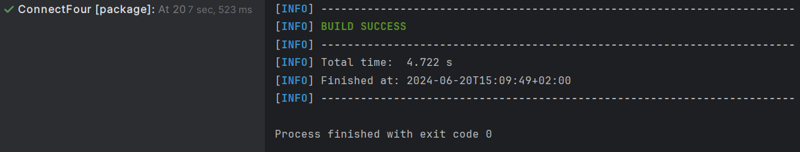
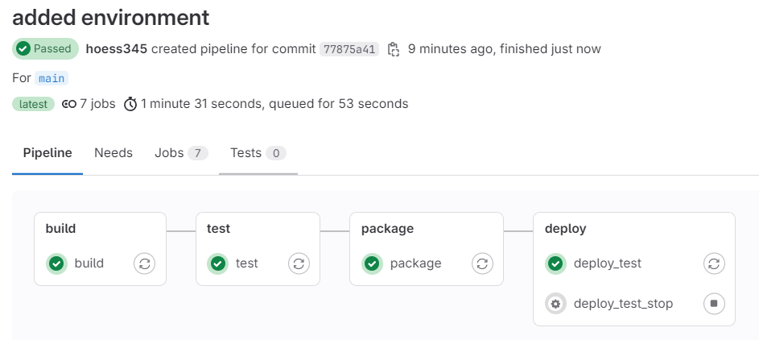
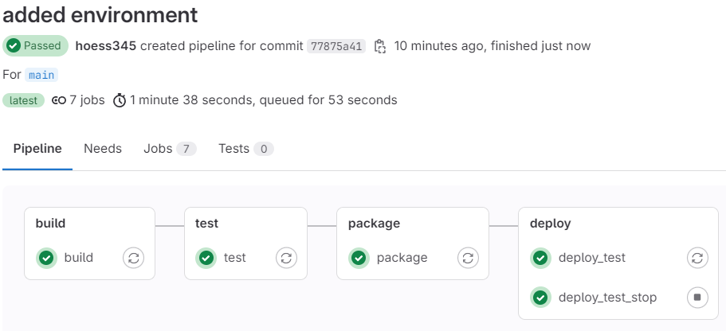

SPW4 - Exercise 3
=================

Name: Yannick Höß

Effort in hours: 3

## 1. Connect Four Web Application and CI/CD Pipeline

### Task 1.a

Hier sieht man, dass die Implementierung von ConnectFour auch am Localhost erreichbar ist.

Die Maven Goals laufen ohne Fehler durch:

### Task 1.b

Mit `deploy_test_stop` kann die Pipeline erfolgreich abgeschlossen werden.  

### Task 1.c
Zuerst wurde der Docker Desktop gestartet. Danach haben die Commands von 1-6 aus dem Setup.md den Runner gestartet.

Danach habe ich ein neues Repo auf GitHub erstellt und mit folgenden Befehlen das Projekt geklont:

`git clone https://github.com/fhooe-se-spw4/exercise3-hoess345.git`  
`cd exercise3-hoess345`  
`git remote rm origin`  
`git remote add origin https://github.com/hoess345/spw4-ue3.git`  
`git push --all origin`  
`git push --tags origin`  

