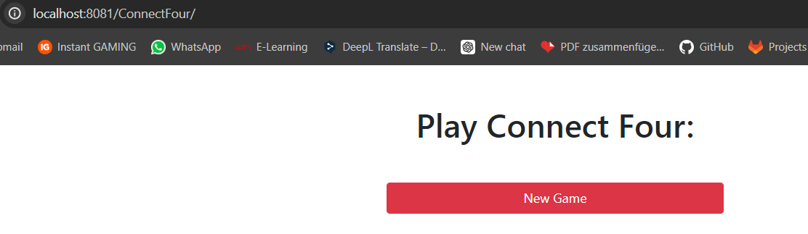

SPW4 - Exercise 3
=================

Name: Yannick Höß

Effort in hours: 3

## 1. Connect Four Web Application and CI/CD Pipeline

### Task 1.a

Hier sieht man, dass die Implementierung von ConnectFour auch am Localhost erreichbar ist.

Die Maven Goals laufen ohne Fehler durch:

### Task 1.b

Mit `deploy_test_stop` kann die Pipeline erfolgreich abgeschlossen werden.  

### Task 1.c
Zuerst wurde der Docker Desktop gestartet. Danach haben die Commands von 1-6 aus dem Setup.md den Runner gestartet.

Danach habe ich ein neues Repo auf GitHub erstellt und mit folgenden Befehlen das Projekt geklont:

`git clone https://github.com/fhooe-se-spw4/exercise3-hoess345.git`  
`cd exercise3-hoess345`  
`git remote rm origin`  
`git remote add origin https://github.com/hoess345/spw4-ue3.git`  
`git push --all origin`  
`git push --tags origin`  

Die Pipeline wird immer beim Pushen auf GitHub gestartet.
0. Jeder Job läuft mit temurin-21.
1. Build: Der Build-Job läuft auf einem Ubuntu-Image, wodurch es wesentlich schneller ist, als es auf meiner 
   Maschine wäre. Wenn erfolgreich compiliert wurde, wird der Output in ein Artefakt gespeichert.
2. Test: Der Test-Job läuft auf einem Ubuntu-Image und führt die Tests aus. Bevor die Tests durchgeführt werden, 
   wird das Artefakt aus dem Build-Job heruntergeladen.
3. Package: Der Package-Job läuft auf einem Ubuntu-Image und führt `mvn package` aus. Auch dieser Job verwendet das 
   Artefakt aus dem Build-Job. Das Ergebnis wird wieder in ein Artefakt gespeichert, welches vom deploy verwendet wird.
4. Deploy: Der "Deploy-Job" läuft im Docker-Image, welches wir zu Begin erstellt haben. Dieser Job stellt die Url 
   für die ConnectFour Web Application bereit. Dieser Job führt keinen Maven-Befehl mehr aus, sondern kopiert das 
   Artefakt vom Package-Job in das WebApps Verzeichnis des Tomcat-Servers.

--> Damit ist die Pipeline erfolgreich durchgelaufen und die Anwendung unter der angegebenen URL verfügbar.

Am Ende schauen das Ergebnis (Pipeline und Pfad) so aus:  

